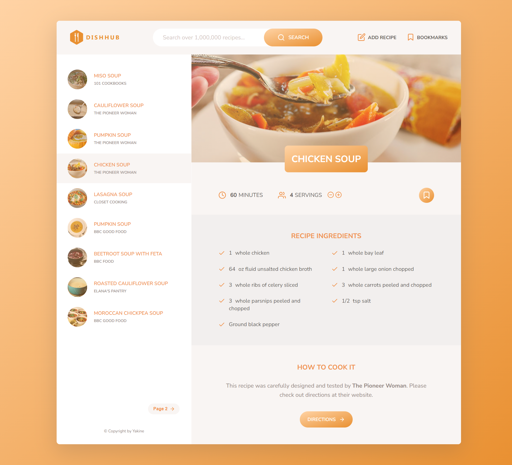

# DishHub

DishHub is an application designed for searching and saving recipes. It has been developed using HTML5, CSS3, and JavaScript, incorporating an intuitive user interface and the ability to dynamically adjust serving sizes. The app utilizes advanced JavaScript concepts, including asynchronous programming, ES6 modules, and object-oriented programming, to deliver a rich and interactive experience.
## Features

- Search for recipes by name or ingredients
- View recipe details: See ingredients, cooking instructions, and serving size.
- Save recipes for later: Bookmark your favorite recipes to revisit them anytime.
- Add your own recipes
- Responsive design

## Demo

Check out the live demo of DishHub [here](https://dishhub-yakine.netlify.app).

## Screenshots

*Caption: Screenshot of the DishHub homepage showcasing recipes.*

## Built with

- JavaScript
- CSS
- HTML
- Parcel
- NPM

## Installation

1. Clone the repository:

git clone https://github.com/Yakine7/DishHub.git

2. Install the dependencies:

npm install

3. Start the development server:
npm start

4. Open your web browser and visit `http://localhost:1234` to access DishHub.

## Contributing

Contributions are welcome! If you would like to contribute to DishHub, please follow these steps:

1. Fork the repository.
2. Create a new branch.
3. Implement your changes and commit them.
4. Push your changes to your forked repository.
5. Submit a pull request.

## License

This project is licensed under the [MIT License](LICENSE).

## Contact

If you have any questions or suggestions, feel free to reach out to me.

Happy cooking with DishHub!